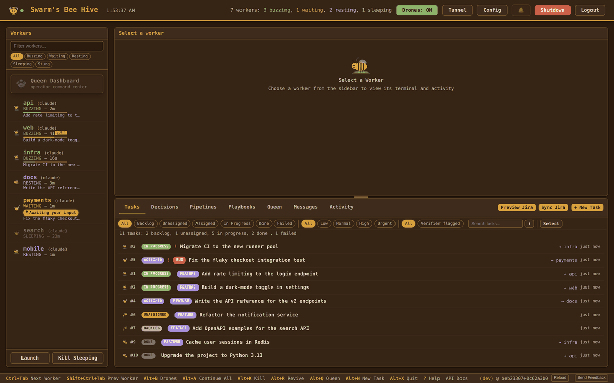
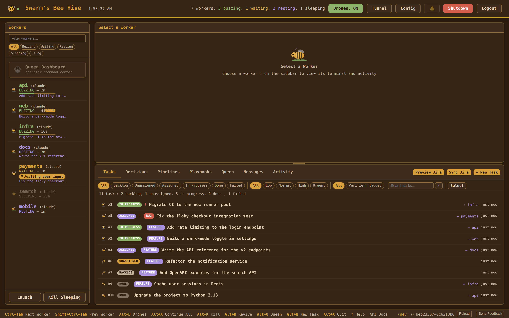
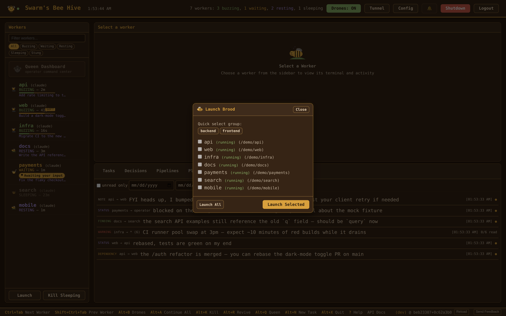
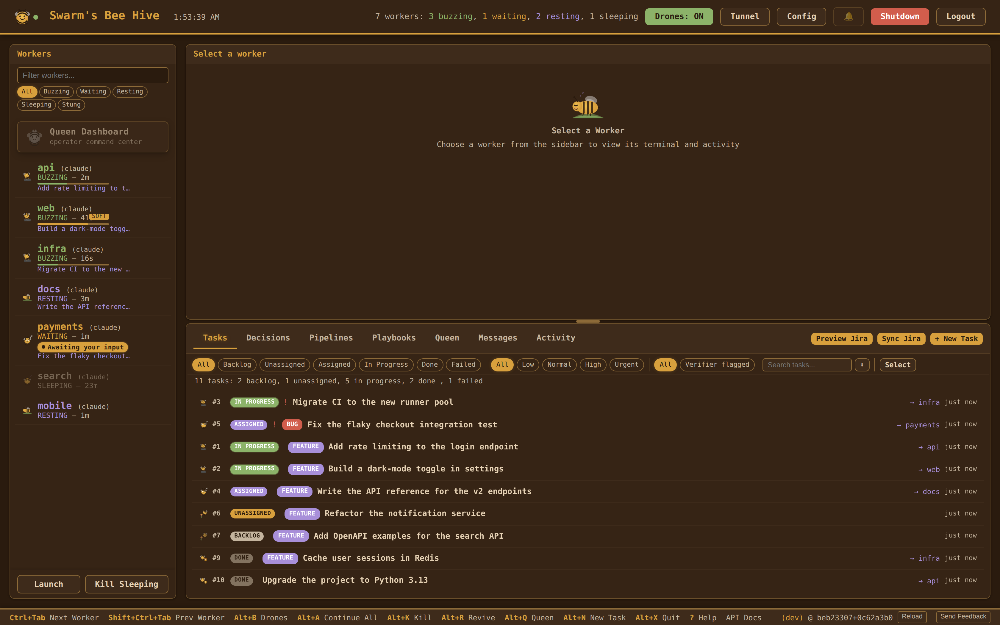
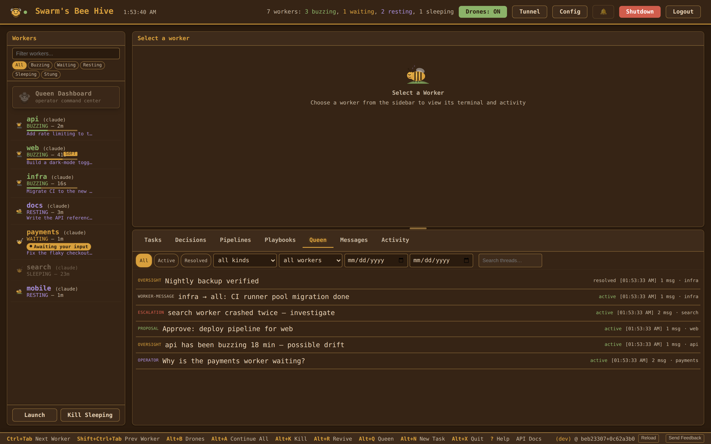
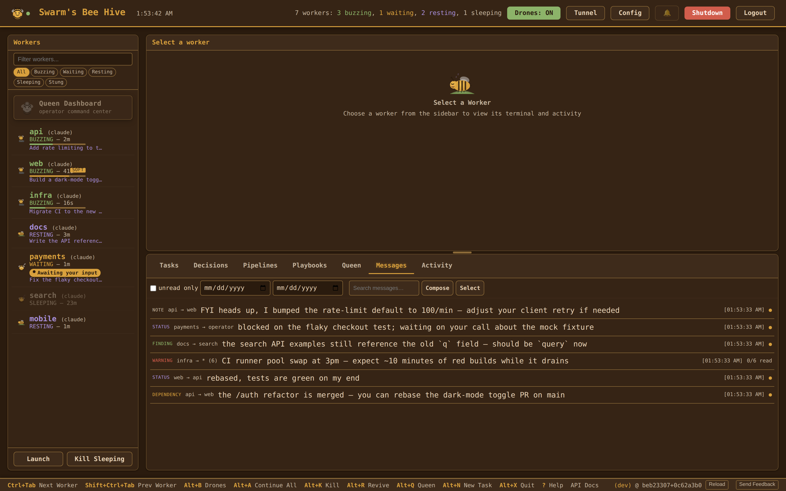
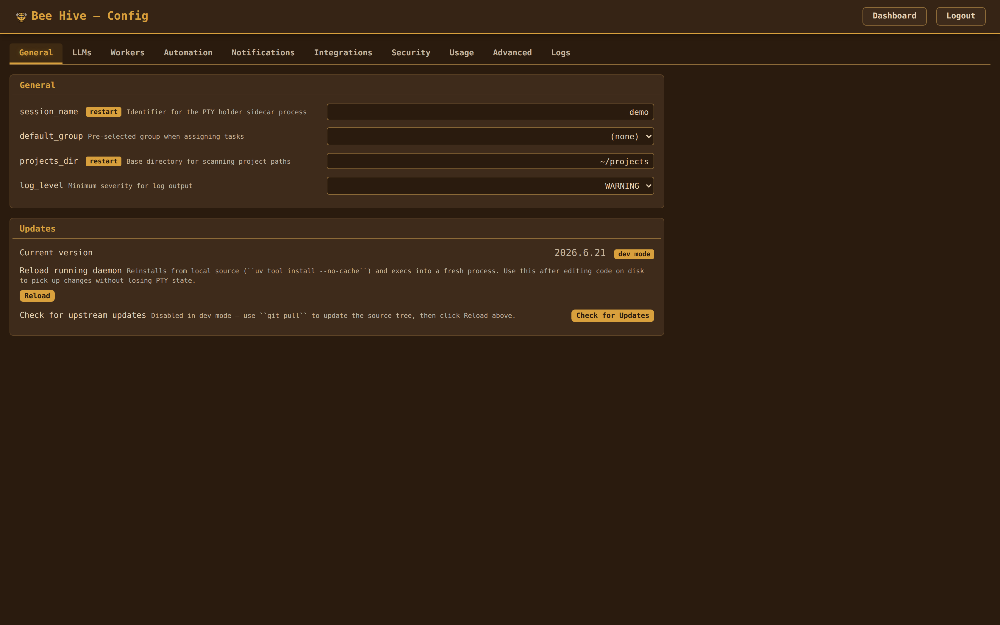

# Swarm

A web-based control center for AI coding agents — [Claude Code](https://docs.anthropic.com/en/docs/claude-code), [Gemini CLI](https://github.com/google-gemini/gemini-cli), and [Codex CLI](https://github.com/openai/codex). Manage one agent or ten from a single browser tab — with autopilot, a task board, AI coordination, and email integration.

Every agent session runs in a managed PTY. The **web dashboard** gives you real-time visibility into all of them: read their output, type into their terminals, create and assign tasks, and let background **drones** handle routine approvals so your agents never stall. A **Queen** conductor watches the hive, proposes task assignments, detects when work is done, and drafts email replies — all surfaced as proposals you approve with one click.

<p align="center">
  
</p>



## Why Swarm

**Your agent sessions never stall.** **Drones** — Swarm's background poll workers — auto-approve safe prompts, revive crashed agents, and escalate the hard decisions to the **Queen** (a headless Claude conductor) or the operator. You stop babysitting and start reviewing results.

**You manage work, not windows.** Create tasks on a board. The Queen assigns them to the right worker based on project descriptions. When a worker finishes, the Queen detects it and proposes completion — you approve with one click.

**Your browser is the control room.** Interactive terminal attach lets you type directly into any worker's agent session from the dashboard. Drag an email onto the task board to create a bug ticket. When it's fixed, a draft reply lands in your Outlook.

**It works for one session too.** You don't need ten agents to benefit. Even a single agent session gets autopilot, a task queue, and a dashboard with terminal access.

## Features

**Web Dashboard** (primary interface)

- **Live terminal attach** -- type into any worker's agent session from the browser (PTY over WebSocket)
- **Task board** -- compact one-or-two-line task rows; click a row to open the full Edit modal with a WYSIWYG description editor (formatting toolbar, paste-from-Word/Outlook → Markdown, View-source toggle), priority/filtering, dependencies, and inline file attachments
- **Drag-and-drop import** -- drop `.eml`/`.msg` files (or an Outlook message tile, or a Jira issue URL / `KEY-N`) onto the task board to create a task with the source content imported and rendered as Markdown
- **Queen proposals** -- approve or reject AI recommendations with confidence scores, one click or in bulk
- **Config editor** -- tabbed UI: General, LLMs, Workers, Automation, Notifications, Integrations, Security, Usage, Advanced, Logs
- **Approval rules editor** -- visual regex rule builder for drone auto-approve/escalate decisions
- **Worker management** -- spawn ad-hoc workers, launch groups, kill/revive individuals, all at runtime
- **Outlook integration** -- connect via OAuth from the config page, fetch emails directly
- **Browser notifications** -- push alerts when workers need attention

**Autopilot**

- **Background drones** -- specialized watchers handle routine decisions so workers don't stall (see *Drones* below for the full roster)
- **Queen conductor** -- headless Claude that assigns tasks, detects completion, resolves conflicts
- **Proposal system** -- Queen actions require operator approval; nothing executes without your sign-off
- **Approval rules** -- regex patterns decide what drones auto-approve vs escalate to the Queen
- **Skill workflows** -- tasks dispatch as Claude Code skill commands (`/fix-and-ship`, `/feature`, `/verify`), backed by a SQLite registry with per-skill usage counts
- **Per-worker Swarm slash commands** -- every worker auto-installs `/swarm-status`, `/swarm-handoff`, `/swarm-finding`, `/swarm-warning`, `/swarm-blocker`, `/swarm-progress` into its `.claude/commands/` so the most-used coordination tools show up in `/help` and read cleanly in transcripts
- **Per-worker Swarm Skills** -- workers also auto-install the `/swarm-checkpoint` Skill (runs `/check`, then commits on green or reports a blocker on red) and the `/swarm-coordinate` Skill (advisory peer/task survey for delegation suggestions; never auto-creates tasks)
- **Pipelines** -- multi-step workflows with agent, automated, and human steps, dependency ordering, templates, and 5-field cron schedules (e.g. `"30 14 * * 1-5"` for weekday afternoons; legacy `HH:MM` still works)
- **Approval-rate gauge** -- dashboard header shows the drones' auto-approval percentage over the last 24h; `GET /api/drones/approval-rate` exposes the counters
- **Sandbox opt-in** -- enable Claude Code's native sandbox via `sandbox:` in `swarm.yaml`; Swarm detects CC version at install time and merges the overrides into `~/.claude/settings.json` when supported

**Drones**

Drones are specialized background sweepers that share the daemon's poll loop. Each runs at its own cadence and writes every action to the buzz log so the operator can audit and tune.

- **IdleWatcher** -- nudges RESTING/SLEEPING workers that have an assigned task; recovers post-reload sessions whose client-side MCP tools dropped by injecting `/mcp` and following up with the task description
- **InterWorkerMessageWatcher** -- nudges idle workers about unread inter-worker messages; widens the filter when the worker has no active task so informational findings/notes are not lost
- **PressureManager** -- system-wide memory/swap watcher that suspends and resumes workers under host-level pressure
- **ContextPressure drone** -- watches per-worker `context_pct`; injects `/compact` when the conversation fills (soft tier auto-compacts idle workers; hard tier interrupts BUZZING workers and defers WAITING ones)
- **Verifier drone** -- adversarial post-completion check that fires after every `swarm_complete_task`; tier 1 deterministic gates (empty diff / no `/check` evidence / open peer warning) short-circuit before any LLM call, tier 2 calls a dedicated verifier subprocess. Reopens the task with findings as a peer warning, or escalates to a Queen thread after the second consecutive failed retry. Operator override via `queen_force_complete_task` skips verification.
- **OversightHandler / TaskLifecycle / FileOwnership / StateTracker** -- supporting drones for Queen oversight, task transitions, file-claim coordination, and state classification

**Worker Coordination (MCP)**

- **MCP server** -- Swarm exposes an HTTP MCP server at `/mcp` so the agents themselves can coordinate via tool calls
- **15 coordination tools** -- `swarm_check_messages`, `swarm_send_message`, `swarm_task_status`, `swarm_claim_file`, `swarm_complete_task`, `swarm_create_task`, `swarm_park_task` (hand the current task back to the queue), `swarm_get_learnings`, `swarm_get_playbooks` (recall reusable procedures synthesized from past successes), `swarm_report_progress`, `swarm_report_blocker` (declare task-dependency blocker, suppresses idle nudges), `swarm_query_peers` (read-only snapshot of peer worker state for handoff decisions), `swarm_note_to_queen` (lightweight side-channel note), `swarm_draft_email` (create a Microsoft Graph draft in the operator's Outlook Drafts folder — never sent automatically), and `swarm_batch` (run multiple ops in one round-trip)
- **Inter-worker messages** -- workers send findings, warnings, dependencies, and status updates to each other (or broadcast)
- **File claims** -- advisory locks prevent two workers from editing the same file at once
- **Learnings** -- resolutions from completed tasks are searchable by other workers for context
- **Compact telemetry** -- every `/compact` logs tokens before/after and the compression ratio so you can measure how effective compaction is per worker

**Service handlers (pipeline AUTOMATED steps)**

- `shell_command`, `webhook_notify`, `headless_claude` -- run shell commands, post webhooks, or invoke a headless Claude as a pipeline step
- `file_uploader`, `youtube_scraper` -- upload files to a sink, pull new videos from tracked YouTube channels
- `claude_code_security` -- run `claude code security scan --json`, deduplicate findings by `(rule_id, path, line)`, and return them for downstream steps to turn into tasks

**Also included**

- **Jira integration** -- two-way sync with Jira Cloud (OAuth 2.0), import/export tasks, create Jira issues from the task board
- **REST API** -- full JSON API with 80+ endpoints and OpenAPI docs at `/api/docs/ui` (open `http://localhost:9090/api/docs/ui` with the dashboard running)
- **SQLite persistence** -- tasks, proposals, messages, pipelines, skills, and history are stored in `~/.swarm/swarm.db`; YAML is the seed/import format
- **Resource monitoring** -- memory/swap thresholds with optional auto-suspend of workers on system pressure
- **In-app feedback** -- a footer button opens a bug / feature / question form; submissions are filed as GitHub issues via the `gh` CLI, with a preview-and-edit step and automatic redaction of sensitive paths
- **Remote access** -- Cloudflare Tunnel support for reaching the dashboard from a phone or remote machine; optional named domain via `tunnel_domain`
- **Notifications** -- terminal bell, desktop, and browser push alerts
- **Tool-usage analytics** -- `swarm analyze-tools` summarises MCP calls, errors, and active workers from the buzz log so you can spot tool descriptions that need rewriting
- **Test harness reproducibility** -- `swarm test --pin-model=<id>` records an infra snapshot (model, provider, worker count, env fingerprint) in every test report so regressions are debuggable instead of mysterious

## Requirements

- Python 3.12+ (ships with the SQLite 3 stdlib Swarm uses for `swarm.db`)
- [uv](https://docs.astral.sh/uv/)
- [GitHub CLI](https://cli.github.com/) (`gh`) — optional; required only for the in-app feedback submitter
- **WSL users:** systemd must be enabled inside WSL for the auto-start service. `swarm init` detects when it's not and offers to configure `/etc/wsl.conf` for you (requires sudo).
- At least one AI coding agent CLI:
  - [Claude Code](https://docs.anthropic.com/en/docs/claude-code) (`claude`) — production-ready, also powers the Queen conductor
  - [Gemini CLI](https://github.com/google-gemini/gemini-cli) (`gemini`) — experimental
  - [Codex CLI](https://github.com/openai/codex) (`codex`) — experimental

## Installation

```bash
uv tool install git+https://github.com/miopea/swarm.git
```

This puts `swarm` on your PATH. No clone, no venv. Then run the setup wizard:

```bash
swarm init
```

This does four things:
1. **Installs Claude Code hooks** -- auto-approves safe tools (Read, Edit, Write, Glob, Grep) so workers don't stall on every file access
2. **Generates config** -- scans `~/projects` for git repos, lets you pick workers and define groups, writes to `~/.config/swarm/config.yaml`
3. **Installs background service** -- systemd user service (Linux/WSL) or launchd Launch Agent (macOS) that auto-starts the dashboard on boot and restarts on crash.
4. **Sets API password** -- optionally protects the web dashboard's config page from unauthorized changes

The dashboard is live at `http://localhost:9090` immediately after init. On WSL, a VBS auto-start script is placed in your Windows Startup folder so the full chain works unattended: **Windows boots → VBS wakes WSL → systemd starts → dashboard is ready.**

If a config already exists, `swarm init` offers three choices: **keep** the current config, **port** settings (carry over passwords, drone/queen tuning, notifications, etc. while refreshing workers from a new project scan), or start **fresh** (backs up the old config to `.yaml.bak`).

## Quick Start

The dashboard is already running after `swarm init`. Open it and launch your first workers:

1. Open `http://localhost:9090`
2. Click **Launch Brood** and select the workers or groups to start

Workers appear in real-time. Attach to any terminal, create tasks, and let drones handle the rest.



The dashboard auto-starts on boot — just open the app each day. You can also launch workers from the CLI with `swarm start` (see [CLI Reference](#cli-reference)).

## Install as App (PWA)

Installing the PWA is the recommended way to use Swarm -- it gives you a native-app experience with its own window and title bar.

- **Chrome / Edge:** open `http://localhost:9090`, then click the install icon in the address bar (or menu → Apps → Install Swarm).
- **Safari (macOS / iOS):** Share → Add to Home Screen / Add to Dock (limited PWA support — some features may be missing).
- **Firefox:** desktop PWAs are not supported; use a bookmark instead.

**Offline support:** a service worker caches the app shell. If the server restarts, the app auto-reconnects when it comes back.

**App badge:** the app icon shows a badge with the count of pending proposals (via the PWA Badge API).

## Web Dashboard

The web dashboard is the primary interface. It auto-starts on boot via systemd (Linux/WSL) or launchd (macOS) and connects via WebSocket for real-time updates. Open the PWA or visit `http://localhost:9090` (port configurable via `port` in swarm.yaml).

**What you get:**

- **Worker sidebar** -- live state indicators (BUZZING/RESTING/WAITING/STUNG), one-click continue/kill/revive
- **Interactive terminal** -- click "Attach" to open any worker's agent session in an in-browser terminal (full xterm.js PTY). Type commands, approve plans, interact directly.
- **Task board** -- filterable by status and priority; tasks render as compact rows (click to open the Edit modal); WYSIWYG description editor with formatting toolbar, live preview, and View-source toggle; drag `.eml`/`.msg` / Outlook tiles / Jira URLs to create tasks; Queen proposals banner with approve/reject/approve-all
- **Config page** -- tabbed editor with sections for General, LLMs, Workers, Automation (drones · Queen · workflows · pipelines), Notifications, Integrations (Microsoft Graph + Jira via OAuth), Security, Usage, Advanced, and Logs (live log viewer with severity filter and a running-daemon log-level dropdown)
- **Bottom-panel tabs** -- the work surface switches between Tasks, **Decisions** (Queen proposals + decision history), **Pipelines** (multi-step workflow runs), and **Playbooks** (procedures synthesized from past successes)
- **Queen tab** -- searchable archive of every Queen thread (operator chats, oversight findings, escalations, proposals); filter by status (active/resolved), kind, and worker, or search titles + message bodies; click a thread for a read-only transcript, and reopen a resolved one to follow up
- **Messages tab** -- the inter-worker message stream (findings, warnings, dependencies, status, notes): content search, unread-only and date filters, click a message for full detail, compose to a worker or broadcast, and bulk-delete; `*` broadcasts collapse to one row with per-recipient read state
- **Activity tab** -- the buzz log: a real-time feed of autopilot decisions and system events, with browser push alerts







If `api_password` is set in the config (or `SWARM_API_PASSWORD` env var), config mutations require a Bearer token.

### Keyboard Shortcuts

| Key | Action |
|-----|--------|
| `Ctrl+]` / `Ctrl+Tab` / `Alt+]` | Next worker |
| `Ctrl+[` / `Shift+Ctrl+Tab` / `Alt+[` | Previous worker |
| `Alt+B` | Toggle drones |
| `Alt+A` | Continue all idle workers |
| `Alt+K` | Kill worker |
| `Alt+R` | Revive worker |
| `Alt+N` | New task |
| `Alt+X` | Quit |

## Task System

Tasks flow through a skill-based workflow pipeline. Each task type maps to a Claude Code slash command that handles the full pipeline — planning, execution, testing, and committing.

### Task Types and Workflows

| Type | Skill Command | Pipeline |
|------|---------------|----------|
| **Bug** | `/fix-and-ship` | Trace root cause → TDD fix → minimal patch → commit & push |
| **Feature** | `/feature` | Read patterns → implement → test → validate |
| **Verify** | `/verify` | Pull latest → run tests → verify behavior → report pass/fail |
| **Chore** | *(inline steps)* | Complete task → validate → commit |

If a task fails, mark it **failed** from the task row actions (or via `POST /api/tasks/{id}/fail`). Failed tasks can be reopened (`POST /api/tasks/{id}/reopen`) or reassigned without losing history — the full audit trail lives in `task_history`.

Skill commands are configurable via the `workflows:` section in swarm.yaml. Set a value to empty to disable skill invocation for that type and fall back to inline instructions.

### Task Lifecycle

1. **Create** -- from the dashboard, CLI (`swarm tasks create`), or by dragging an email onto the task board
2. **Assign** -- Queen proposes an assignment (or operator assigns manually) → worker receives skill invocation. Tasks with `depends_on` are blocked until all dependency tasks are completed.
3. **Execute** -- worker's agent session runs the skill pipeline
4. **Complete** -- Queen detects idle worker, proposes completion with resolution summary → operator approves
5. **Reply** *(optional)* -- if the task came from an email, a draft reply is created in Outlook

Tasks also support file attachments via the dashboard UI. Drag `.eml` or `.msg` files onto the task board to create tasks from emails — see [Email Integration](#email-integration) for setup and reply drafting.

## Pipelines

Pipelines are multi-step workflows that layer on top of the task board. Use them when a job is bigger than a single task — e.g. "triage → fix → verify → deploy" — and you want each step handled by a different actor.

**Step types:**
- **AGENT** -- dispatched to a worker (runs a skill command like `/fix-and-ship`)
- **AUTOMATED** -- runs a built-in action (e.g. pull latest, run tests)
- **HUMAN** -- blocks on operator approval before moving forward

Pipelines support per-step dependencies, templates for common shapes, and lifecycle controls (start / pause / resume). State is persisted in SQLite; the dashboard shows a live view of in-flight pipelines and their steps.

Manage pipelines from the dashboard or the REST API (`/api/pipelines`, see [REST API](#rest-api)).

## Queen & Proposals

Swarm runs **two Queen instances** by design:

- **Interactive Queen** — a full Claude Code PTY session, your conversational coordinator. Reached by clicking the Queen worker tile in the dashboard. Stateful, learning-aware, thread-aware. Handles operator-facing work: answering questions, framing trade-offs, directing workers via `queen_prompt_worker`, posting decision threads.
- **Headless Queen** — a stateless `claude -p` subprocess, the swarm's decision function for high-volume drone-driven calls: drone auto-assign, oversight of stuck workers, completion verification, escalation analysis. Parallel, shallow, cheap. Never touches the operator's conversation directly.

All Queen *actions* (from either) that affect workers or tasks go through the **proposal system** — the operator reviews and approves or rejects each one from the dashboard.

### What the Queens Do

- **Analyze workers** — when drones escalate a stuck worker, the headless Queen assesses the situation and recommends an action (continue, send message, restart, or wait)
- **Assign tasks** — headless Queen matches idle workers to pending tasks based on descriptions and project context
- **Detect completion** — headless Queen monitors assigned workers for completion signals (commits, test results, "done" messages); a high-confidence "not done" verdict backs off re-polling for 30 min instead of re-asking every 5
- **Draft email replies** — generates professional replies for email-sourced tasks when completed
- **Coordinate with the operator** — the interactive Queen converses, surfaces what matters, and uses Queen-tier MCP tools (`queen_prompt_worker`, `queen_reassign_task`, `queen_force_complete_task`, `queen_save_learning`, `queen_post_thread`) to act on operator directives

### Proposal Flow

```
Headless Queen analyzes hive state
  → creates proposal (assignment, escalation, or completion)
  → proposal appears in dashboard with confidence score
  → operator approves or rejects
  → approved actions execute automatically
```

### Interactive Queen CLAUDE.md

The interactive Queen reads her role from `~/.swarm/queen/workdir/CLAUDE.md` — seeded on first daemon start from the `QUEEN_SYSTEM_PROMPT` constant in `swarm.queen.runtime`. **The operator can edit this file**; the Queen also edits it herself to document coordination policies learned through operator feedback.

On each daemon startup, Swarm reconciles the on-disk `CLAUDE.md` against the shipped constant using a three-state compare (what shipped last time vs what shipped now vs what's on disk):

- Shipped unchanged → no-op regardless of local edits.
- Shipped changed, no local edits → auto-update in place.
- Shipped changed AND local edits present → **drift-flagged**: Swarm writes `CLAUDE.md.shipped-latest` and `CLAUDE.md.shipped-last` alongside your live file, notifies the Queen's inbox, logs a buzz entry. Your live file is never auto-overwritten.

Reconcile from the CLI:

```
swarm queen sync-claude-md                     # three-way status (no writes)
swarm queen sync-claude-md --accept-shipped    # take the new ship; discard local edits
swarm queen sync-claude-md --keep-local        # acknowledge drift; preserve local
```

### Configuration

- **`queen.system_prompt`** — *headless-decision prompt* only. Prepended to the `claude -p` calls (auto-assign, oversight, completion eval, escalation). Leave empty on fresh install and the daemon seeds `HEADLESS_DECISION_PROMPT` automatically. The *interactive Queen's* role lives in `~/.swarm/queen/workdir/CLAUDE.md`, not this field.
- **`queen.min_confidence`** — confidence threshold on a `0.0–1.0` scale (default `0.7`). Proposals at or above the threshold are eligible for auto-execution; below it they stay pending until the operator approves.
- **`queen.cooldown`** — minimum seconds between headless-Queen invocations (default `30`, rate limiting)
- **`queen.oversight`** — proactive monitoring of active workers: prolonged-BUZZING detection, task-drift checks, and an hourly oversight call budget
- **Auto-tuning** — Swarm records when an operator overrides a drone decision and surfaces `swarm.yaml` diff suggestions from the "Tuning Suggestions" card in the dashboard

Plans always require human approval regardless of confidence (confidence is forced to 0.0).

## MCP for Workers

Swarm runs an MCP (Model Context Protocol) server on the same port as the dashboard so the agents themselves can coordinate without going through the operator. Each worker is registered as an MCP client pointing at `http://localhost:9090/mcp`, and gets access to these tools:

| Tool | Purpose |
|------|---------|
| `swarm_check_messages` | Read pending messages sent to this worker |
| `swarm_send_message` | Send a finding, warning, dependency, or status to another worker (or broadcast) |
| `swarm_task_status` | Query the task board (all / pending / assigned / mine); pass `{number: N}` to fetch the full detail of a single task — description, priority, type, tags, deps, jira key, acceptance criteria, context refs, attachments, resolution |
| `swarm_create_task` | Create a task, optionally targeted at another worker |
| `swarm_complete_task` | Mark the currently assigned task done with a resolution |
| `swarm_park_task` | Hand the current task back to `ASSIGNED` (an intentional set-down, not a blocker) |
| `swarm_report_progress` | Report phase / percent / narrative status — broadcasts over WebSocket to the dashboard |
| `swarm_report_blocker` | Declare a task blocked on another task; IdleWatcher skips nudges until the upstream task completes or a new message arrives |
| `swarm_query_peers` | Read-only snapshot of peer worker state (name, state, current task, context %, idle time, queue depth) to decide whether to hand off — never interrupts a peer |
| `swarm_note_to_queen` | Send a lightweight side-channel note to the Queen (auto-relays into her PTY; not a formal message) |
| `swarm_draft_email` | Create a draft email in the operator's Outlook Drafts folder via Microsoft Graph. Draft is never auto-sent — operator reviews + sends manually. Requires the Graph integration to be configured. |
| `swarm_claim_file` | Take an advisory lock on a file path (60s TTL) before editing shared code |
| `swarm_get_learnings` | Search resolutions and learnings from previously completed tasks |
| `swarm_get_playbooks` | Recall reusable procedures synthesized from previously-successful tasks (look before re-deriving a solved approach) |
| `swarm_batch` | Run multiple swarm_* ops in a single round-trip (sequential; nested batch rejected) |

The server speaks both Streamable HTTP (`POST /mcp`) and legacy SSE (`GET /mcp/sse` + `POST /mcp/message`) so any MCP-capable client works. Claude Code hook installation wires this up automatically during `swarm init`.

### Queen MCP tools

The interactive Queen has her own, elevated MCP tool surface — separate from the worker-facing tools above. She uses these to observe hive state and act on it on the operator's behalf:

| Tool | Purpose |
|------|---------|
| `queen_view_worker_state` | State, task, PTY tail for any worker |
| `queen_view_task_board` | Open and recent tasks |
| `queen_view_messages` | Raw inter-worker message log (pass `full=true` when relaying verbatim) |
| `queen_view_message_stream` | Same log joined to recipient state; `actionable_only=true` narrows to idle + unread |
| `queen_view_buzz_log` | System activity feed |
| `queen_view_drone_actions` | What the drones are deciding |
| `queen_query_learnings` | Operator corrections from past decisions |
| `queen_prompt_worker` | Push a prompt into a worker's PTY (elevated: workers cannot do this to each other) |
| `queen_reassign_task` | Move a task between workers |
| `queen_force_complete_task` | Close a task the worker finished but forgot to mark done |
| `queen_interrupt_worker` | Stop a stuck worker |
| `queen_post_thread` / `queen_reply` / `queen_update_thread` | Thread conversation with the operator |
| `queen_save_learning` | Record a judgement correction |

## Email Integration

Swarm integrates with Microsoft Graph to create tasks from Outlook emails and draft replies on completion.

### Setup

1. Register an Azure AD app with `Mail.ReadWrite` and `offline_access` permissions
2. Add `http://localhost:9090/auth/graph/callback` as a redirect URI
3. Configure in swarm.yaml:

```yaml
integrations:
  graph:
    client_id: "your-azure-app-client-id"
    tenant_id: "your-tenant-id"        # or "common" for multi-tenant
```

4. Connect from the Config page in the web dashboard (OAuth PKCE flow — no client secret needed)

### How It Works

1. **Import** — drag `.eml`/`.msg` files onto the task board, drag a message tile straight from the Outlook desktop client (Swarm prefers the Graph fetch path so the full body and attachments come along, not just the subject), or fetch directly from Outlook via the dashboard. Each email becomes a task with the original message attached.
2. **Assign** — the Queen proposes the right worker; the operator approves (or assigns manually).
3. **Work** — the worker runs the task's skill pipeline.
4. **Reply drafted** — when the task is marked complete, the Queen writes a 3–4 sentence professional reply and saves it to your Outlook **Drafts** folder. It is **never** auto-sent.
5. **Review and send** — open Outlook, review the draft, and send manually.

HTML email bodies are converted to Markdown before storage (paragraphs, lists, headings, blockquotes, code, inline marks, embedded `cid:` images), so task descriptions read cleanly in the dashboard and pasted Outlook content survives a round-trip into the WYSIWYG task editor.

Tokens are stored in `~/.swarm/swarm.db` (`secrets` table) and auto-refreshed on expiry.

## Jira Integration

Swarm integrates with Jira Cloud for two-way task sync — import Jira issues as Swarm tasks and push status updates back to Jira.

### Setup

Authentication uses Atlassian OAuth 2.0 (3LO):

1. Register an app at [developer.atlassian.com/console/myapps/](https://developer.atlassian.com/console/myapps/)
2. Add `http://localhost:9090/auth/jira/callback` as a callback URL
3. Enable scopes: `read:jira-work`, `write:jira-work`, `offline_access`
4. Configure in swarm.yaml:

```yaml
integrations:
  jira:
    enabled: true
    client_id: "your-atlassian-app-id"
    client_secret: "$JIRA_CLIENT_SECRET"   # plain text or $ENV_VAR reference
    project: PROJ
```

5. Connect from the Config page in the web dashboard (OAuth flow — tokens auto-refresh)

### How It Works

- **Import**: pulls issues matching a JQL filter (optionally filtered by label via `import_label`). Deduplicates by Jira key.
- **Drag-and-drop import**: drop a Jira issue URL (or a bare `KEY-N`) onto the task panel and a single `POST /api/jira/import-by-key` call pulls the issue, comments, and attachments into a new task — no JQL config needed for one-off imports.
- **ADF → Markdown**: descriptions and comments authored in Atlassian Document Format are converted to Markdown on import (paragraphs, headings, lists, blockquotes, code blocks, inline marks, mentions, emojis, links), so the rendered task description matches what you see in Jira.
- **Export**: task status changes in Swarm auto-sync back to Jira via transitions and completion comments
- **Create**: push Swarm tasks to Jira as new issues with mapped type/priority (Bug→Bug, Feature→Story, Chore/Verify→Task)
- **Sync frequency**: configurable via `sync_interval_minutes` (default `5`). Swarm status changes are always pushed to Jira on the next sync; Swarm does not overwrite Jira-side edits on fields it doesn't manage.
- **Tokens**: stored in `~/.swarm/swarm.db` (`secrets` table), auto-refreshed on expiry

### Configuration

```yaml
integrations:
  jira:
    enabled: true
    client_id: "your-atlassian-app-id"
    client_secret: "$JIRA_CLIENT_SECRET"
    project: PROJ
    sync_interval_minutes: 5
    import_label: swarm           # only import tickets with this label (blank = all)
    import_filter: ""             # custom JQL (overrides project + label defaults)
    status_map:
      pending: "To Do"
      in_progress: "In Progress"
      completed: Done
      failed: "To Do"
```

## Remote Access

Swarm includes built-in Cloudflare Tunnel support for accessing the dashboard from a phone or remote machine — no port forwarding required. Toggle it from the dashboard toolbar (Tunnel ON/OFF). Configure a named domain with `tunnel_domain` in swarm.yaml.

## Updating

The dashboard checks for updates automatically on startup and shows a banner when a new version is available — click **Update & Restart** to install it. You can also check manually from the dashboard footer. Your config (`swarm.yaml`) is never touched by upgrades.

Claude Code hooks and the cross-task hook script (`~/.swarm/hooks/cross-task-hook.sh`) are automatically reinstalled every time the daemon starts (`swarm serve`), so they stay in sync with the installed package version — no manual `swarm init` or `swarm install-hooks` needed after upgrades.

For the historical roadmap (Tier 1–3 items shipped, deferred items, future research bundles) see [`docs/features-roadmap.md`](docs/features-roadmap.md) and [`docs/claude-code-roadmap.md`](docs/claude-code-roadmap.md).

## Service Management

`swarm init` handles service setup automatically (systemd on Linux/WSL, launchd on macOS). These commands are for manual overrides:

```bash
swarm install-service              # install/start the service
swarm install-service --uninstall  # remove it
systemctl --user status swarm      # check status
journalctl --user -u swarm -f     # stream service logs
```

Uninstalling the service leaves your config and database untouched — `~/.config/swarm/` and `~/.swarm/` (including `swarm.db`) are preserved so you can reinstall without losing state.

**WSL prerequisite:** systemd must be enabled inside WSL. `swarm init` detects when it's not and offers to configure `/etc/wsl.conf` automatically (requires sudo). After enabling, restart WSL (`wsl --shutdown` from PowerShell) and re-run `swarm init`.

## CLI Reference

| Command | Description |
|---------|-------------|
| `swarm start [target]` | Launch workers + web dashboard + open browser |
| `swarm launch <target>` | Start workers (group name, worker name, number, or `-a`) |
| `swarm serve` | Run web dashboard in foreground |
| `swarm status` | One-shot status check of all workers |
| `swarm send <target> <msg>` | Send a message to a worker, group, or `all` |
| `swarm kill <worker>` | Kill a worker's PTY process |
| `swarm tasks <action>` | Manage tasks (`list`, `create`, `assign`, `complete`) |
| `swarm web start\|stop\|status` | Manage web dashboard as background process |
| `swarm daemon` | Headless daemon with REST + WebSocket API |
| `swarm stop` | Stop a running swarm daemon (graceful SIGTERM, then SIGKILL) |
| `swarm holder-restart` | Restart the PTY holder in place via handoff — every worker's PTY survives, workers don't lose their Claude Code conversation |
| `swarm init` | Set up hooks, config, background service, and API password |
| `swarm update` | Check for and install updates from GitHub |
| `swarm validate` | Validate config |
| `swarm install-hooks` | Install Claude Code auto-approval hooks |
| `swarm install-service` | Install/manage background service (systemd or launchd) |
| `swarm check-states` | Diagnostic: show current worker states from PTY ring buffer |
| `swarm analyze-tools [--since=7d] [--json]` | Summarise MCP tool usage from the buzz log (calls / errors / error samples per tool) |
| `swarm test --pin-model=<id>` | Run orchestration tests and pin the model identifier in the infra snapshot for reproducibility |
| `swarm db <stats\|export\|prune\|backup\|restore\|check>` | Database management — inspect, export, prune, back up, restore, and integrity-check `~/.swarm/swarm.db`. `restore` recovers from a backup (newest auto-backup by default), keeping the replaced DB at `swarm.db.pre-restore` |
| `swarm queen sync-claude-md [--accept-shipped\|--keep-local]` | Three-way reconcile the interactive Queen's CLAUDE.md against the shipped `QUEEN_SYSTEM_PROMPT` constant. No flags = status report; `--accept-shipped` overwrites on-disk with shipped; `--keep-local` ack drift + preserve edits |
| `swarm queen contribute-claude-md` | Reverse-sync local interactive-Queen CLAUDE.md edits back into the shipped `QUEEN_SYSTEM_PROMPT` constant — for promoting operator-tuned coordination policy into the next ship |
| `swarm test` | Run supervised orchestration tests — scaffolds a synthetic project, auto-resolves proposals, and generates an AI-powered report to `~/.swarm/reports/` |
| `swarm tunnel [--port N]` | Start Cloudflare Tunnel for remote HTTPS access |

### Global Flags

| Flag | Env Var | Description |
|------|---------|-------------|
| `-c <path>` | | Config file path. Honoured **only** when `~/.swarm/swarm.db` has no user data (fresh install / explicit DB-empty bootstrap); silently ignored on populated DBs with a WARNING log. |
| `--log-level <LEVEL>` | `SWARM_LOG_LEVEL` | Logging verbosity (`DEBUG`, `INFO`, `WARNING`, `ERROR`) |
| `--log-file <path>` | `SWARM_LOG_FILE` | Log to file |
| `--version` | | Show version and exit |

## Environment Variables

| Variable | Description |
|----------|-------------|
| `SWARM_PORT` | Override the web dashboard / API server port (default: 9090). If 9090 is already in use, set `SWARM_PORT=9091` (or any free port) before launching `swarm serve`. |
| `SWARM_SESSION_NAME` | Override the session name |
| `SWARM_WATCH_INTERVAL` | Override the poll interval (seconds) |
| `SWARM_DAEMON_URL` | Connect to a remote daemon URL |
| `SWARM_API_PASSWORD` | Set API password (alternative to config file) |
| `SWARM_DEV` | Switch installed binary to dev mode (`1` = auto-detect source, or path to source root). Re-invokes via `uv run`, skips update checks, serves web assets from source tree. |
| `SWARM_LOG_LEVEL` | Override log verbosity (`DEBUG`, `INFO`, `WARNING`, `ERROR`) |
| `SWARM_LOG_FILE` | Log to file (path) |

Environment variables override the corresponding config file values.

## Configuration

All settings are managed from the web dashboard at `/config` — a tabbed editor with sections for General, LLMs, Workers, Automation (drones · Queen · workflows · pipelines), Notifications, Integrations, Security, Usage, Advanced, and Logs. Changes save directly to `~/.swarm/swarm.db` and are hot-applied in the same request — no daemon restart required.



**Runtime state lives in SQLite — `~/.swarm/swarm.db` is the source of truth.** On first run Swarm seeds the DB from a YAML (renaming the source file to `config.yaml.migrated` once consumed); from then on the daemon reads and writes workers, groups, approval rules, tasks, proposals, task history, messages, pipelines, buzz log, secrets, and scalar config directly from the DB. Dashboard edits hit the DB immediately and are hot-applied in the same request; **YAML is not re-written** by the dashboard. Use `swarm db stats`, `swarm db export`, `swarm db backup`, `swarm db restore`, and `swarm db prune` to inspect and maintain it (the daemon also auto-backs-up daily and runs an integrity check).

**YAML is a bootstrap-only seed.** `swarm init` writes the initial config to `~/.config/swarm/config.yaml` and you can also place a `swarm.yaml` in your project directory. The YAML loaders are consulted **only when `swarm.db` has no user data** (fresh install, explicit DB-empty bootstrap). For a populated DB the YAML loaders — including the `-c /path/to/config.yaml` flag — are intentionally ignored, with a WARNING log on every silently-discarded `-c`. Re-importing from YAML after first run is possible but explicit; treat `swarm.yaml` as a seed/import format, not a live mirror.

### Full Example

```yaml
session_name: swarm
projects_dir: ~/projects
port: 9090                             # web UI / API server port
provider: claude                       # global default: claude | gemini | codex
watch_interval: 5                      # seconds between poll cycles
log_level: WARNING                     # DEBUG, INFO, WARNING, ERROR
trust_proxy: false                     # trust X-Forwarded-For when behind a reverse proxy
domain: ""                             # public domain (used as WebAuthn RP ID)

workers:
  - name: api
    path: ~/projects/api-server
    description: "NestJS API — handles auth, users, and billing"
    isolation: worktree               # run in git worktree for file isolation
  - name: web
    path: ~/projects/frontend
    description: "Next.js dashboard — admin UI, reports, settings"
    provider: gemini                   # per-worker override (experimental)
  - name: tests
    path: ~/projects/test-suite

groups:
  - name: default
    workers: [api, web]
  - name: all
    workers: [api, web, tests]

default_group: default                 # auto-launched when no target specified

drones:
  enabled: true
  poll_interval: 5.0                   # seconds between polls
  poll_interval_buzzing: 0.0           # override for BUZZING (0 = 2× base)
  poll_interval_waiting: 0.0           # override for WAITING (0 = base)
  poll_interval_resting: 0.0           # override for RESTING (0 = 3× base)
  sleeping_poll_interval: 30.0         # interval for SLEEPING workers
  auto_approve_yn: false               # auto-approve Y/N prompts
  max_revive_attempts: 3               # revives before giving up
  escalation_threshold: 120.0          # seconds idle before escalating to Queen
  max_poll_failures: 5                 # consecutive failures before circuit breaker
  max_idle_interval: 30.0              # max backoff interval when idle
  auto_stop_on_complete: true          # stop drones when all tasks complete
  auto_approve_assignments: true       # drones auto-approve Queen task assignments
  idle_assign_threshold: 3             # seconds idle before proposing assignment
  auto_complete_min_idle: 45.0         # seconds idle before proposing completion
  sleeping_threshold: 900.0            # seconds idle before RESTING → SLEEPING
  stung_reap_timeout: 30.0             # seconds before auto-removing a STUNG worker
  context_warning_threshold: 0.7       # warn at 70% context usage
  context_critical_threshold: 0.9      # alert at 90% context usage
  speculation_enabled: false           # speculative task prep (experimental)
  allowed_read_paths:                  # Read() auto-approved for these paths
    - ~/.swarm/uploads/
  state_thresholds:
    buzzing_confirm_count: 3           # consecutive readings before BUZZING → RESTING
    stung_confirm_count: 2             # consecutive readings before → STUNG
    revive_grace: 15.0                 # seconds grace after revive (ignore STUNG)
  approval_rules:
    - pattern: \bplan\b                # plans always escalate to operator
      action: escalate
    - pattern: "delete|remove|drop"    # destructive actions escalate
      action: escalate
    - pattern: ".*"                    # everything else auto-approved
      action: approve

queen:
  enabled: true
  cooldown: 30.0                       # min seconds between Queen invocations
  min_confidence: 0.7                  # below this, proposals require approval
  max_session_calls: 20                # API calls before rotating session
  max_session_age: 1800.0              # seconds before rotating session (30 min)
  queen_thread_retention_days: 90      # purge resolved Queen chat threads after N days (0 = keep forever)
  system_prompt: |
    You coordinate agents working across our codebase.
    Match tasks to workers by project path. Never assign overlapping
    files to two workers on the same codebase.
  oversight:
    enabled: true
    buzzing_threshold_minutes: 15.0    # alert if worker buzzes longer than this
    drift_check_interval_minutes: 10.0 # how often to check for task drift
    max_calls_per_hour: 6              # rate limit for oversight API calls

coordination:
  mode: worktree                       # "single-branch" or "worktree"
  auto_pull: true                      # auto-pull changes from remote
  file_ownership: warning              # "off", "warning", or "hard-block"
  message_retention_days: 30           # prune read inter-worker messages after N days (unread are never auto-deleted; 0 = keep forever)

workflows:
  bug: /fix-and-ship
  feature: /feature
  verify: /verify
  # chore: /my-custom-skill           # override chore workflow

integrations:
  graph:
    client_id: "your-azure-app-id"
    tenant_id: "your-tenant-id"
  jira:
    enabled: true
    client_id: "your-atlassian-app-id"
    client_secret: "$JIRA_CLIENT_SECRET"
    project: PROJ
    sync_interval_minutes: 5
    import_label: swarm
    status_map:
      completed: Done
      in_progress: "In Progress"

custom_llms:
  - name: deepseek
    command: ["deepseek-cli"]          # CLI command to launch the provider
    display_name: DeepSeek
    tuning:
      idle_pattern: "\\$\\s*$"
      busy_pattern: "thinking"

provider_overrides:
  gemini:
    idle_pattern: "❯\\s*$"
    approval_key: "y"

notifications:
  terminal_bell: true                  # ring the terminal bell for high-priority events
  desktop: true                        # OS desktop notifications (libnotify / osascript)
  debounce_seconds: 5.0                # min gap between notifications for the same event
  # browser push notifications are delivered automatically to any connected dashboard
  # that has granted the Notification API permission (approval needed, queen intervention, etc.)

resources:                             # system resource monitoring
  enabled: true
  poll_interval: 10.0                  # seconds between resource snapshots
  elevated_mem_pct: 80.0               # mem % -> ELEVATED warning
  high_mem_pct: 90.0                   # mem % -> HIGH (auto-suspend workers if suspend_on_high)
  critical_mem_pct: 95.0               # mem % -> CRITICAL
  elevated_swap_pct: 40.0              # swap % -> ELEVATED (only escalates when mem is also strained)
  high_swap_pct: 70.0
  critical_swap_pct: 85.0
  suspend_on_high: true                # auto-suspend workers at HIGH pressure
  dstate_scan: true                    # scan for wedged (D-state) processes
  dstate_threshold_sec: 120.0          # D-state age before alerting

action_buttons:                        # dashboard action bar buttons
  - label: "Revive"
    action: revive                     # built-in: revive, refresh, kill
    style: secondary                   # CSS class: secondary, queen, danger
  - label: "Refresh"
    action: refresh
    style: secondary
  - label: "Clear Session"
    command: /clear                    # custom: sends text to worker
    show_mobile: false                 # hide on mobile
  - label: "Get Latest"
    command: /get-latest
  - label: "Kill"
    action: kill
    style: danger

task_buttons:                          # task row action buttons
  - label: "Edit"
    action: edit                       # edit, assign, done, unassign, fail, reopen, log, retry_draft, remove
  - label: "Assign"
    action: assign
  - label: "Done"
    action: done
  - label: "Reopen"
    action: reopen

test:
  enabled: false
  port: 9091                           # separate port for test dashboard
  auto_resolve_delay: 4.0             # seconds before auto-resolving proposals
  report_dir: ~/.swarm/reports
  auto_complete_min_idle: 10.0

# api_password: "your-secret"         # protect config mutations
# tunnel_domain: my-swarm.example.com  # named Cloudflare tunnel domain
# log_file: ~/.swarm/swarm.log        # optional file logging
# daemon_url: http://localhost:9090    # dashboard connects via daemon API
```

### Notable Fields

- **`provider`** -- global AI provider (`claude`, `gemini`, `codex`). Claude is production-ready; Gemini and Codex are experimental stubs. Per-worker `provider` overrides the global default.
- **`workers[].description`** -- helps the Queen match tasks to workers; shown in dashboards
- **`default_group`** -- auto-launched when you run `swarm start` with no target
- **`drones.approval_rules`** -- regex pattern → action (`approve` or `escalate`) for choice menus
- **`queen.system_prompt`** -- *headless-decision prompt only* (auto-assign, oversight, completion eval, escalation). Leave empty to auto-seed `HEADLESS_DECISION_PROMPT` on daemon start. The interactive Queen's role lives in `~/.swarm/queen/workdir/CLAUDE.md`, edited in place (see `swarm queen sync-claude-md` for update-drift reconciliation).
- **`workflows`** -- override skill commands per task type; set to empty to disable
- **`drones.poll_interval_buzzing/waiting/resting`** -- per-state poll interval overrides (set to `0` to use defaults derived from `poll_interval`: buzzing=2×, waiting=1×, resting=3×)
- **`drones.allowed_read_paths`** -- paths where Read() tool auto-approves without escalation
- **`drones.auto_complete_min_idle`** -- seconds a worker must be idle before Queen proposes task completion
- **`action_buttons`** -- customize the dashboard action bar (built-in actions or custom commands)
- **`task_buttons`** -- customize the task row action buttons
- **`tunnel_domain`** -- custom domain for a named Cloudflare tunnel (leave empty for random subdomain)
- **`integrations.graph`** -- Azure AD app credentials for Outlook email integration
- **`integrations.jira`** -- Jira Cloud credentials and sync settings (OAuth 2.0)
- **`queen.oversight`** -- automated monitoring of worker progress (buzzing threshold, drift checks, rate limits)
- **`coordination`** -- multi-worker coordination mode (`single-branch` or `worktree`) and file ownership tracking (`off`, `warning`, `hard-block`)
- **`workers[].isolation`** -- `"worktree"` to run the worker in a git worktree for file isolation
- **`custom_llms`** -- define custom AI CLI tools beyond the built-in claude/gemini/codex providers
- **`provider_overrides`** -- customize state detection patterns, approval keys, and env settings per provider
- **`drones.state_thresholds`** -- tunable hysteresis for state detection (buzzing confirm count, stung confirm count, revive grace period)
- **`drones.sleeping_threshold`** -- seconds of idle before a RESTING worker transitions to SLEEPING (reduced poll rate)
- **`drones.stung_reap_timeout`** -- seconds before a STUNG worker is auto-removed
- **`drones.context_warning_threshold` / `context_critical_threshold`** -- fractions of Claude's context window that trigger warning / critical alerts
- **`trust_proxy`** -- honor `X-Forwarded-For` when running behind a reverse proxy
- **`domain`** -- public domain used as the WebAuthn Relying Party ID for passkey auth
- **`resources`** -- memory / swap thresholds; at HIGH workers auto-suspend, at CRITICAL the operator is paged. Also enables D-state process scanning.

## REST API

The daemon exposes a JSON API on the same port as the web dashboard. All mutating `/api/` endpoints require an `X-Requested-With` header (CSRF protection).

### Endpoints

| Group | Routes | Description |
|-------|--------|-------------|
| **Health** | `GET /health`, `GET /ready`, `GET /api/health` | Liveness, readiness, server status |
| | `GET /api/usage` | Token usage statistics (per-worker, queen, total) |
| | `GET /api/resources`, `GET /api/resources/history` | Memory / swap / system pressure stats |
| | `GET /api/search` | Global dashboard search (workers, tasks, messages) |
| | `GET /api/docs`, `GET /api/docs/ui` | OpenAPI spec and Swagger UI |
| **Workers** | `GET /api/workers`, `GET /api/workers/{name}` | List workers, worker detail |
| | `POST /api/workers/{name}/send`, `/continue`, `/kill`, `/revive`, `/escape`, `/interrupt`, `/analyze` | Worker actions |
| | `POST /api/workers/launch`, `/spawn`, `/continue-all`, `/send-all`, `/discover` | Bulk operations |
| **Drones** | `GET /api/drones/log`, `GET /api/drones/status` | Drone state |
| | `POST /api/drones/toggle`, `POST /api/drones/poll` | Drone control |
| | `GET /api/drones/rules/analytics` | Rule hit statistics |
| | `GET /api/drones/approval-rate` | Auto-approval rate over a rolling window (`?hours=24`) |
| | `GET /api/drones/tuning` | Drone tuning suggestions |
| | `POST /api/drones/rules/suggest` | AI-suggested approval rules |
| **Tasks** | `GET /api/tasks`, `POST /api/tasks` | List / create tasks |
| | `POST /api/tasks/{id}/assign`, `/start`, `/complete`, `/fail`, `/unassign`, `/reopen` | Task lifecycle |
| | `POST /api/tasks/{id}/approve`, `/reject` | Plan-mode approval gate (user-channel tasks) |
| | `POST /api/tasks/{id}/force-complete` | Force-close a wedged task (bypasses the verifier/BLOCKED guard) |
| | `PATCH /api/tasks/{id}`, `DELETE /api/tasks/{id}` | Edit / remove |
| | `POST /api/tasks/bulk` | Bulk action over multiple tasks (complete / fail / reopen / assign / remove) |
| | `POST /api/tasks/cross` | Create a cross-project handoff task |
| | `GET /api/tasks/export`, `GET /api/tasks/history` | Export the board / search task history |
| | `POST /api/tasks/from-email`, `POST /api/tasks/{id}/attachments` | Email import, file upload |
| | `POST /api/tasks/{id}/retry-draft` | Retry email draft generation |
| | `GET /api/tasks/{id}/history` | Per-task audit trail |
| **Proposals** | `GET /api/proposals` | List pending proposals |
| | `POST /api/proposals/{id}/approve`, `/reject` | Approve / reject |
| | `POST /api/proposals/reject-all` | Bulk reject |
| | `GET /api/decisions` | Proposal history / audit trail |
| **Queen** | `GET /api/queen/queue`, `GET /api/queen/health` | Queen call-queue status, runtime health |
| | `GET /api/queen/oversight` | Queen oversight monitor status |
| | `GET /api/queen/threads`, `POST /api/queen/threads` | List (filter `?status&kind&worker&q&since&until&limit&offset`) / start a thread |
| | `GET /api/queen/threads/{id}`, `POST /api/queen/threads/{id}/messages` | Thread transcript / post a reply |
| | `POST /api/queen/threads/{id}/resolve`, `/reopen` | Resolve or reopen a thread |
| | `GET /api/queen/learnings`, `DELETE /api/queen/learnings/{id}` | List / delete saved Queen learnings |
| **Messages** | `POST /api/messages/send` | Send an inter-worker message (finding, warning, dependency, status, note) |
| | `GET /api/messages`, `GET /api/messages/{worker}` | Recent messages (filter `?q&unread_only&since&until&limit&offset`) / inbox for a worker |
| | `POST /api/messages/{worker}/read`, `POST /api/messages/delete` | Mark read / bulk delete by id |
| **Playbooks** | `GET /api/playbooks`, `GET /api/playbooks/analytics` | List playbooks / synthesis analytics |
| | `GET /api/playbooks/{name}/events` | Event history for a playbook |
| | `POST /api/playbooks/{name}/promote`, `/retire` | Promote to fleet-active / retire |
| **Attention** | `GET /api/attention` | Command-center attention feed (active threads needing the operator) |
| | `POST /api/attention/{id}/reply`, `/resolve` | Respond to / resolve an attention item |
| **Analytics** | `GET /api/analytics/summary` | Task throughput, completion-time, and per-worker stats (`?days=N`) |
| **Pipelines** | `GET /api/pipelines`, `POST /api/pipelines` | List / create pipelines |
| | `GET /api/pipelines/{id}`, `PUT /api/pipelines/{id}`, `DELETE /api/pipelines/{id}` | Read / update / delete |
| | `POST /api/pipelines/{id}/start`, `/pause`, `/resume` | Pipeline lifecycle |
| | `POST /api/pipelines/{id}/steps/{step_id}/complete\|fail\|skip` | Per-step transitions |
| **MCP** | `POST /mcp`, `GET /mcp`, `DELETE /mcp` | Streamable HTTP MCP transport |
| | `GET /mcp/sse`, `POST /mcp/message` | Legacy SSE MCP transport |
| **Groups** | `POST /api/groups/{name}/send` | Broadcast to group |
| **Config** | `GET /api/config`, `PUT /api/config` | Read / update config |
| | `POST /api/config/workers`, `DELETE /api/config/workers/{name}` | Worker CRUD |
| | `POST /api/config/groups`, `PUT /api/config/groups/{name}`, `DELETE /api/config/groups/{name}` | Group CRUD |
| | `POST /api/config/workers/{name}/save` | Save a running worker to config |
| | `POST /api/config/workers/{name}/add-to-group` | Add a worker to a group |
| **Skills** | `GET /api/skills` | List registered skills with `{name, description, task_types, usage_count, last_used_at}` |
| | `GET /api/config/projects` | Scan for projects |
| **Jira** | `GET /api/jira/status` | Jira sync status and stats |
| | `GET /api/jira/preview` | Preview importable Jira issues |
| | `POST /api/jira/sync` | Trigger manual Jira sync |
| | `POST /api/tasks/{id}/jira`, `POST /api/tasks/{id}/jira/refresh` | Create / refresh the Jira issue linked to a task |
| **Auth** | `GET /auth/jira/login`, `/callback`, `/status`, `POST /auth/jira/disconnect` | Jira OAuth flow |
| | `GET /auth/graph/login`, `/callback`, `/status`, `POST /auth/graph/disconnect` | Graph OAuth flow |
| **Coordination** | `GET /api/coordination/ownership` | File ownership map |
| | `GET /api/coordination/sync` | Auto-pull sync status |
| **Other** | `GET /api/conflicts` | Active file conflicts |
| | `GET /api/notifications` | Notification history |
| **Tunnel** | `POST /api/tunnel/start`, `/stop`, `GET /api/tunnel/status` | Remote access |
| **Session** | `POST /api/session/kill`, `POST /api/server/stop` | Shutdown |
| | `POST /api/server/restart` | Restart the server |
| **Files** | `POST /api/uploads` | File upload |
| **WebSocket** | `GET /ws` | Live event stream (workers, tasks, drones, proposals) |
| | `GET /ws/terminal` | Interactive terminal attach (PTY bridge) |

**Auth:** Config-mutating endpoints (`PUT /api/config`, worker/group CRUD) require `Authorization: Bearer <api_password>` when `api_password` is set.

### Security

- All mutating `/api/` endpoints require an `X-Requested-With` header (CSRF protection)
- Rate limited at 60 requests/minute per client IP
- `api_password` protects config mutations via Bearer token (`Authorization: Bearer <password>`)

## Architecture

```
┌─────────────────────────────────────────────────────────┐
│  Web Dashboard (:9090)                                   │
│  interactive terminals · keyboard shortcuts              │
│  drag-and-drop email                                     │
├─────────────────────────────────────────────────────────┤
│  REST API + WebSocket          Proposals UI              │
│  OpenAPI docs · search         Swagger at /api/docs/ui   │
├─────────────────────────────────────────────────────────┤
│  Background Drones             Queen Conductor           │
│  (poll → decide → act)         (headless claude -p)      │
│  approval rules · revive       analyze · assign · reply  │
├─────────────────────────────────────────────────────────┤
│  Task Board · Pipelines        Email / Jira Integration  │
│  skill workflows · steps       Microsoft Graph · Jira API│
│  .eml/.msg import              OAuth · two-way sync      │
├─────────────────────────────────────────────────────────┤
│  MCP Server (/mcp)             Inter-worker Messages     │
│  15 worker · 15 Queen tools    findings · warnings · etc │
│  file claims · learnings       dedup · read tracking     │
│  playbooks (synthesized)       health-sweep · digests    │
├─────────────────────────────────────────────────────────┤
│  SQLite (~/.swarm/swarm.db)    Notification Bus          │
│  tasks · proposals · history   terminal · desktop · push │
│  messages · pipelines · config resource monitor          │
├─────────────────────────────────────────────────────────┤
│  PTY Holder (sidecar)                                    │
│  ┌────────┐ ┌────────┐ ┌────────┐                        │
│  │ worker │ │ worker │ │ worker │  ...                   │
│  │  api   │ │  web   │ │ tests  │                        │
│  └────────┘ └────────┘ └────────┘                        │
└─────────────────────────────────────────────────────────┘
```

**Worker states:**
- **BUZZING** -- actively working (Claude is processing)
- **RESTING** -- idle, waiting for input (< 5 min)
- **SLEEPING** -- idle > 5 min (display-only); drones use `sleeping_poll_interval` (default `30s`) for reduced polling frequency
- **WAITING** -- blocked on a prompt (plan approval, choice menu, user question)
- **STUNG** -- exited or crashed

The PTY-over-WebSocket terminal bridge supports up to 20 concurrent sessions.

**Decision layers:**
1. **Hooks** -- per-worker Claude Code hooks for instant tool approvals
2. **Drones** -- background polling that auto-approves, revives, and escalates
3. **Queen** -- headless Claude for cross-worker coordination, task assignment, and email replies

## Testing

`swarm test` runs a supervised end-to-end orchestration test against a dedicated instance (port `9091` by default).

1. **Scaffolds a synthetic project** -- copies a fixture project to a temp directory and initializes a git repo with pre-loaded tasks from `tasks.yaml`
2. **Auto-resolves proposals** -- a TestOperator subscribes to new proposals, waits `auto_resolve_delay` seconds (default `4.0`), then asks the Queen to evaluate and approve or reject each one
3. **Generates an AI-powered report** -- computes aggregated stats (decision distribution, rule hits, state changes, latency, Queen confidence), runs a headless LLM for actionable suggestions (rule changes, threshold adjustments, uncovered patterns), and writes a markdown report with cross-run trend comparisons

Reports are saved as JSONL logs at `~/.swarm/reports/`. Configure via the `test:` section in swarm.yaml.

## Development

```bash
git clone https://github.com/miopea/swarm.git
cd swarm
uv sync                    # install dependencies
uv run swarm --help        # run CLI from source
uv run pytest tests/ -q    # run test suite
uv run ruff check src/     # linting
uv run ruff format src/    # formatting
```

### Releases

Swarm uses calver (`YYYY.M.D[.N]`). The release helper at `scripts/release.py` bumps the version anchor across `pyproject.toml` and `src/swarm/__init__.py` and promotes `CHANGELOG.md`'s `## Unreleased` section to a dated entry in a single motion. The global `/ship` slash command auto-detects this script and runs it before committing — no manual invocation required for normal flows. See `~/.claude/CLAUDE.md` (Release Management) for the contract every release script must honour.

## Contributing

Contributions are welcome — see [CONTRIBUTING.md](CONTRIBUTING.md) for setup,
the local test/lint gate, and code conventions. Bug reports and feature
requests go in [GitHub issues](https://github.com/miopea/swarm/issues).

## License

MIT — see [LICENSE](LICENSE).
